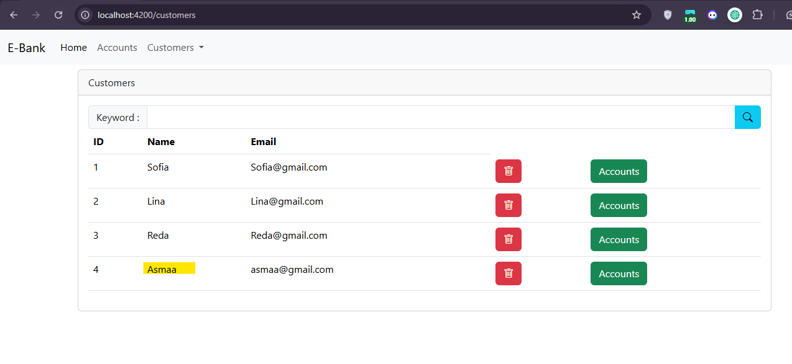
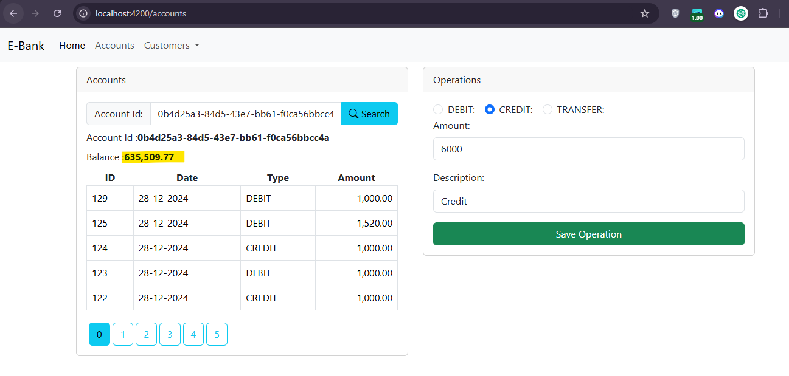

<h1>Projet JEE - Digital Banking</h1>

Ce projet illustre la gestion des comptes bancaires, avec des fonctionnalités pour la gestion des clients, des comptes et des opérations bancaires.

<h2>Gestion des Comptes Bancaires</h2>

<h3>Affichage d'un compte par ID</h3>

<h2>Gestion des Clients</h2>
<h3>Liste des clients</h3>

<h3>Ajout d'un client</h3>

<h3>Client ajouté avec succès</h3>

<h2>Gestion des Opérations Bancaires</h2>

<h2>Débit</h2>
<h3>Avant débit</h3>

<h3>Après débit</h3>

<h2>Crédit</h2>
<h3>Avant crédit</h3>

<h3>Après crédit</h3>

<h2>Virements=/h2>

<h3>Avant Virement - Compte Source</h3>

<h3>Après Virement - Compte Source</h3>

<h3>Avant Virement - Compte Destination</h3>

<h3>Après Virement - Compte Destination</h3>

<h3>Auteur</h3>

Réalisé par : Rahhali Asmaa

